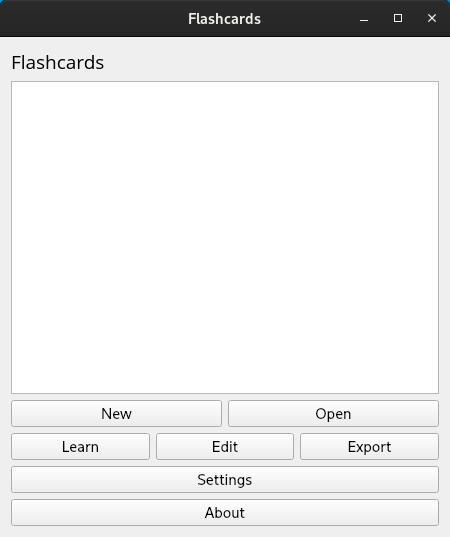
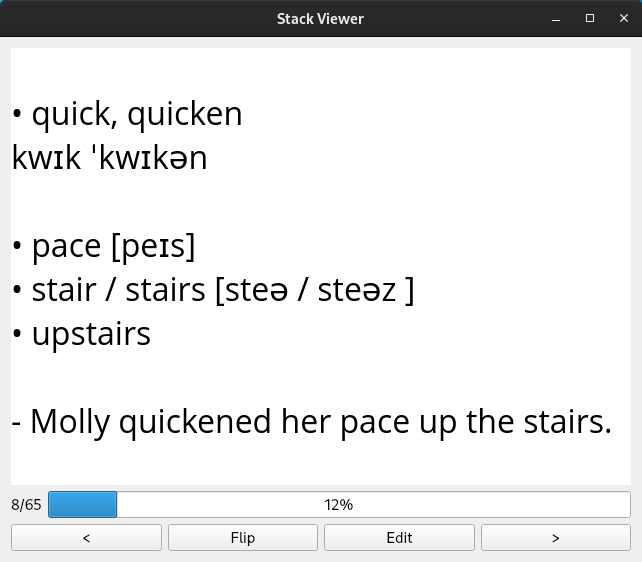

# flashcards


Create, learn and print flashcards.

# Why?
If you want to learn anything (i.e., foreign words) quickly and effectively, you should use flashcards. There are websites which allow you to do pretty much the same. Unlike Quizlet and other such websites, this software is FOSS and lets you export your flashcards in PDF file so you can print it. 

# Installation
1. Install `qt5-base`
2. Build it from sources or download binary
3. Put `config.json` next to binary:
```
{
  "fontFamily": "Open Sans",
  "stacks": [
  ]
}
```

# Screenshots


